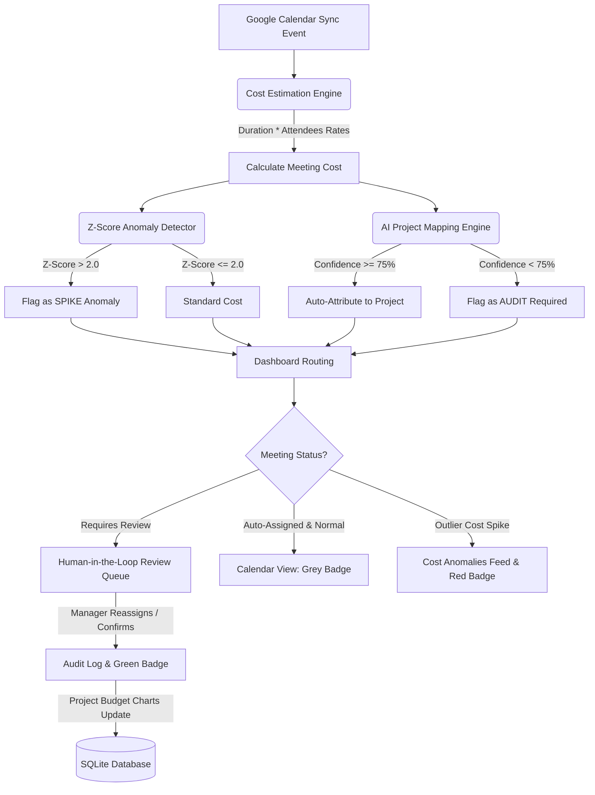

# 👨‍⚖️ Hackathon Judges' Guide: HR Cost Intelligence Engine
### AI-Powered Calendar Resource & Meeting Cost Analytics

Meetings are one of the largest hidden expenditures in modern organizations. The **HR Cost Intelligence Engine** is a full-stack platform that transforms passive calendar data into an active financial ledger. It calculates meeting costs based on attendee salaries, uses AI to attribute meeting hours to project budgets, flags cost spikes, and provides human-in-the-loop review.

---

## 💡 The Core Problem & Our Simple Solution

*   **The Problem**: A calendar invitation seems "free," but dragging 6 highly-paid engineers into an unscheduled 3-hour sync can cost a company thousands of dollars. Even worse, managers have no way to map these meeting costs to project budgets.
*   **The Solution**: We ingest calendar event feeds, dynamically compute meeting costs using employee payroll rates, run AI to attribute the meeting to the correct project, flag statistical outliers, and provide a manager approval queue.

---

## ⚙️ How the Engine Works (Explained Simply)

The system is built on **four core engines** working together in real time:

### 1. Cost Estimation Engine
Whenever a calendar sync occurs, the system calculates the actual monetary cost of a meeting using this simple formula:
$$\text{Meeting Cost} = \text{Duration (hours)} \times \sum (\text{Attendee Hourly Rates})$$

*   *Example*: A 2-hour launch meeting attended by:
    *   **Aarav Sharma** (Lead Engineer - \$250/hr)
    *   **Zeeshan Khan** (Product Manager - \$180/hr)
    *   **Priya Patel** (UX Designer - \$120/hr)
*   *Calculation*: $2.0 \text{ hours} \times (\$250 + \$180 + \$120) = \$1,100$.

### 2. AI Project Attribution Engine
Meetings don't come pre-tagged with project codes. The engine reads the meeting title and description and maps it to the correct project (e.g., *Project Apollo*).
*   **High Confidence ($\ge 75\%$)**: Auto-assigned.
*   **Low Confidence ($< 75\%$)**: Occurs when meeting titles are vague (like *"Touch base"* or *"Quick sync"*). The engine flags these and routes them to the **Human-in-the-Loop Review Queue** for a manager to approve.
*   **Smart Fallback Mode**: If you don't supply an `OPENAI_API_KEY`, the engine automatically switches to a local keyword-matching algorithm, mapping terms like *space/rocket* to Apollo and *security/firewall* to Zeus.

### 3. Z-Score Anomaly Detector
How do we find expensive meeting spikes? We use a statistical formula called a **Z-Score** to compare a meeting's cost against all past meetings:
$$\text{Z-Score} = \frac{\text{Current Meeting Cost} - \text{Average Cost of All Meetings}}{\text{Standard Deviation of Costs}}$$

*   If a meeting's cost is more than **2.0 standard deviations** away from the company average, it is flagged as a red **`SPIKE` (Anomaly)**.
*   *Why this matters*: A 6-hour emergency security breach meeting involving 7 leaders costs **\$4,275**. The system immediately flags this outlier so HR can investigate why it took so long.

### 4. Dynamic Payroll Recalculator
If a manager goes to the admin config and changes an employee's hourly rate (e.g., promoting them from \$120/hr to \$150/hr), the engine:
*   Automatically finds all unreviewed meetings that employee attended.
*   Recalculates their costs.
*   Re-runs the Z-score anomaly check.
*   Updates the dashboard charts, metrics, and leaderboards instantly!

### 5. Attendee Cost Footprint Engine
To identify who is driving meeting costs, the engine dynamically aggregates the total monetary impact of each staff member across all calendar meetings they attend:
$$\text{Staff Footprint} = \sum (\text{Meeting Duration} \times \text{Staff Hourly Rate})$$
The top 5 are displayed in the **Attendee Heavy Hitters Leaderboard**.

### 6. Real-Time Transaction Logger
A client-side audit logger records API queries, Google Calendar syncs, manager resolutions, and rate configurations, piping them into a CLI-style scrollable console box.

### 7. Clean Light / Dark Mode Toggle
*   **Flicker-Free Theme Loading**: Injected an inline, synchronous JavaScript IIFE inside the `<head>` of `index.html` that reads the theme preference (`localStorage`) and applies it to the `document.documentElement` class list before the body renders. This avoids Flash of Unstyled Content (FOUC).
*   **Monochrome Aesthetic Integrity**: In light mode, the dashboard transitions from black/dark graphite to clean white/light gray while keeping the same stark, brutalist monochrome vibe. It automatically maps Tailwind classes via CSS variables under the `.light` theme selector.
*   **Dynamic Recharts Styling**: The project cost chart instantly switches its grid lines, labels, tooltip backgrounds, and bar colors when the theme is toggled.

---

## 🗺️ System Flow (How Data Moves)

The diagram below shows how a calendar sync event flows through our AI attribution, cost calculation, anomaly detection, and human review system:

---

## 🏆 Interactive Demonstration (Step-by-Step)

Follow this 5-step walkthrough to experience the entire system in action:

### Step 1: Examine the Base Dashboard & Toggle Theme
Open [http://localhost:5173](http://localhost:5173).
*   **Toggle Theme**: Click the **Sun/Moon icon** in the header. Observe that the layout instantly transitions between dark and light mode with zero lag or screen flash, and the spent-vs-budget Recharts visualization redraws dynamically.
*   **Attendee Heavy Hitters**: Details the top 5 employees by total meeting cost footprint.
*   **Efficiency Scorecard**: Displays Average Cost per Meeting, Largest Cost Spike, and Vague Meetings Ratio.
*   **Project Expenditure Chart**: A flat side-by-side vertical bar chart comparing the **Allocated Budget** vs **Actual Spent** for 5 projects.
*   **Calendar Audit Schedule**: A daily view showing meetings categorized by color-coded status badges.
*   **System Transaction Terminal**: A monospace log terminal at the very bottom tracking engine actions in real-time.

### Step 2: Trigger the Google Calendar Sync Simulator
Click the white **"Simulate Calendar Sync"** button in the top right. This simulates Google's incremental sync token cycle:
1.  **Click 1 (Syncing Phase 1)**: Syncs regular engineering and marketing meetings. Watch them turn into grey **`AI`** badges on the calendar, and view the corresponding ingest traces in the bottom console terminal.
2.  **Click 2 (Syncing Phase 2)**: Syncs a massive security incident response meeting ($4,275). Watch it display as a red **`SPIKE`** on the calendar and in the alerts feed, while the terminal outputs a bold red `[SYS_ALERTS]` message.
3.  **Click 3 (Syncing Phase 3)**: Syncs an ambiguous meeting (*"Touch base about resources"*). Watch it appear as a dashed yellow **`AUDIT`** card on the calendar and route into the review queue, logged in yellow inside the console.

### Step 3: Act as the Human-in-the-Loop Manager & Open Inspector
1.  Click **any meeting card** in the daily calendar, the anomalies list, or the resolved log.
2.  **Observe**: A sleek **Details Inspector Drawer** slides in from the right, showing duration, attendee individual cost calculations ($hours \times rate$), and AI attribution parameters. Close it.
3.  Go to the **Human-in-the-Loop Review Queue**, select **"Project Athena (AI Platform)"** from the dropdown menu, and click **"Reassign"**.
4.  **Observe**: The card leaves the queue, turns green (**`OK`**) on the calendar, updates the charts, and prints an emerald `[SYS_AUDIT]` log in the terminal.

### Step 4: Test the Re-Allotment & Return Controls
In the **Resolution History / Audit Log** at the bottom:
1.  Locate the meeting you just resolved. Click its left text details column to inspect the details drawer, then close it.
2.  Click **"Re-allot Project"** and select **"Unsure? Send to Review Queue"**.
3.  **Observe**: The meeting returns to the pending queue, turns back into a dashed yellow **`AUDIT`** badge, updates the charts, and logs the action in the console.

### Step 5: Admin Payroll Rate Configuration & Leaderboard Updates
1.  Click **"Payroll Config"** in the top-right header to toggle the admin drawer.
2.  Find **Aarav Sharma** (Lead Engineer) and change his rate from **\$250** to **\$500**. Click outside the input box.
3.  **Observe**: Both the spent charts and the **Attendee Heavy Hitters Leaderboard** recalculate Aarav's total financial impact instantly, while the console prints a blue `[SYS_ADMIN]` trace.

---

## 📂 Codebase Breakdown: What Does What?

*   [backend/app/main.py](file:///c:/Users/Burhan%20Mehdi/OneDrive/Desktop/HR%20Cost%20Intelligence%20Project/backend/app/main.py): Exposes REST APIs, manages database session transactions, handles human reviews, triggers employee rate changes, and simulates calendar sync phases.
*   [backend/app/anomaly.py](file:///c:/Users/Burhan%20Mehdi/OneDrive/Desktop/HR%20Cost%20Intelligence%20Project/backend/app/anomaly.py): Houses the mathematical helper functions. Calculates basic meeting costs and computes standard deviation to find Z-score outliers.
*   [backend/app/ai_service.py](file:///c:/Users/Burhan%20Mehdi/OneDrive/Desktop/HR%20Cost%20Intelligence%20Project/backend/app/ai_service.py): Manages LLM connections. Queries OpenAI Structured Outputs to map meetings to project metadata. Automatically switches to a local keyword-matching algorithm if the API key is missing.
*   [backend/app/seed.py](file:///c:/Users/Burhan%20Mehdi/OneDrive/Desktop/HR%20Cost%20Intelligence%20Project/backend/app/seed.py): Populates the SQLite database with 5 distinct projects (Apollo, Zeus, Marketing, Operations, Athena), 7 employees with realistic hourly rates, and 21 historical meetings.
*   [backend/app/models.py](file:///c:/Users/Burhan%20Mehdi/OneDrive/Desktop/HR%2520Cost%2520Intelligence%2520Project/backend/app/models.py): Defines SQLite database tables (Projects, Employees, Meetings, Attributions) using SQLAlchemy.
*   [frontend/index.html](file:///c:/Users/Burhan%20Mehdi/OneDrive/Desktop/HR%20Cost%20Intelligence%20Project/frontend/index.html): Custom entrypoint HTML. Injects an inline, synchronous theme loader inside `<head>` to prevent Flash of Unstyled Content (FOUC).
*   [frontend/src/App.jsx](file:///c:/Users/Burhan%20Mehdi/OneDrive/Desktop/HR%2520Cost%2520Intelligence%2520Project/frontend/src/App.jsx): The single-page dashboard. Houses theme toggle button state and action handler, and adaptively updates Recharts bar colors and layouts on theme swap.
*   [frontend/src/index.css](file:///c:/Users/Burhan%20Mehdi/OneDrive/Desktop/HR%2520Cost%2520Intelligence%2520Project/frontend/src/index.css): Sets up the CSS theme variables and contains the custom light mode color override classes.
